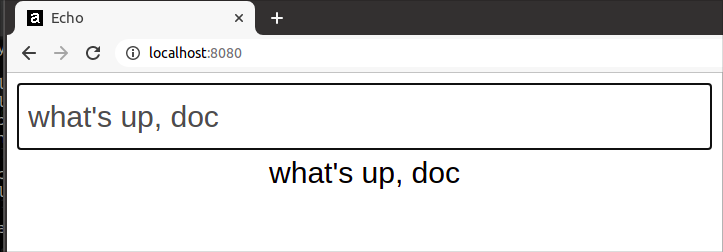

# iced-dynamic-import-sample

Importing `iced_web` (Rust GUI framework) from JS dynamically.

[1. About](#1-about)  
[2. Dev + Build](#2-dev--build)  
[3. Installed NPM Packages](#3-installed-npm-packages)  
&nbsp; &nbsp; [3-1. All](#3-1-all)  
&nbsp; &nbsp; [3-2. Babel](#3-2-babel)  
&nbsp; &nbsp; [3-3. Webpack](#3-3-webpack)  
&nbsp; &nbsp; [3-4. Other Build Tools](#3-4-other-build-tools)  
&nbsp; &nbsp; [3-5. Other Dependencies](#3-5-other-dependencies)  
[4. What I Did](#4-what-i-did)  
&nbsp; &nbsp; [[Step 1] Source Directory for WASM](#step-1-source-directory-for-wasm)  
&nbsp; &nbsp; [[Step 2] Build Directory for WASM](#step-2-build-directory-for-wasm)  
&nbsp; &nbsp; [[Step 3] Writing `build.sh`](#step-3-writing-buildsh)  
&nbsp; &nbsp; [[Step 4] Subdirectory](#step-4-subdirectory)  
&nbsp; &nbsp; [[Step 5] Creating a Symlink](#step-5-creating-a-symlink)  
&nbsp; &nbsp; [[Step 6] `wasm-loader`](#step-6-wasm-loader)  
&nbsp; &nbsp; [[Step 7] `import.meta` (or `file://`)](#step-7-importmeta-or-file)  
&nbsp; &nbsp; [[Step 8] `application/wasm`](#step-8-applicationwasm)  
[5. Notes](#5-notes)  
&nbsp; &nbsp; [5-1. Issue: No `canvas` in the root](#5-1-issue-no-canvas-in-the-root)  
[6. LICENSE](#6-license)



[View Demo](http://tokyo800.jp/mina/iced-dynamic/)

## 1. About

- Use of [iced_web](https://github.com/hecrj/iced/tree/master/web) to provide a WASM app.
- Use of `wasm-bindgen` to prepare the WASM package for JS.
- Instead of inline module imports, asynchronously (dynamically) importing the WASM file from JS.
- Configurations for serving WASM files from a subdirectory.

If you are planning to use `wasm-pack` instead of `wasm-bindgen`,
I have [another sample repo](https://github.com/minagawah/rust-perlin-wasm-test-2), and you want to take a look.

Maybe it is worth showing you the directory structure:

```
├── build.sh
├── public
│   ├── assets
│   │   │ # This is the Webpack output
│   │   │ # directory where JS, CSS,
│   │   │ # or any other resources
│   │   │ # will be served.
│   │   │
│   │   ├── app.xxxxxxxxxxxxxxxxxxxx.js
│   │   └── favicon.ico
│   │
│   │ # While `index.html` is usually
│   │ # output to Webpack output directory,
│   │ # instead, outputting `index.html`
│   │ # to its UPPER DIRECTORY.
│   │
│   ├── index.html
│   │
│   └── wasm
│       └── echo-bot
│           │ # After `cargo build`, we run
│           │ # `wasm-bindgen` in `build.sh`
│           │ # and output the generated
│           │ # set of package here.
│           │ # Except for `package.json`
│           │ # which is created
│           │ # within `build.sh`.
│           │
│           ├── package.json
│           ├── echo-bot_bg.wasm
│           ├── echo-bot_bg.wasm.d.ts
│           ├── echo-bot.d.ts
│           ├── echo-bot.js
│           └── snippets
│
├── src
│ # This is where JS codes reside.
│
└── src_for_wasm
    │ # This is where Rust codes reside.
    │
    └── echo-bot
        ├── Cargo.lock
        ├── Cargo.toml
        ├── src
        │   └── main.rs
        └── target
            │ # This is where `cargo build`
            │ # will build WASM binaries.
            │
            └── wasm32-unknown-unknown
```

&nbsp;

## 2. Dev + Build

### Prerequisite

We are using `toml-cli` and `tr` in `build.sh` to extract the current Cargo package version.

- toml-cli
- tr

```
cargo install toml-cli
```

Also, version for your globally installed `wasm-bidgen` must exact match the one defined in `Cargo.toml`.

### Dev

```
### IMPORTANT

After you clone the repo, make sure that you:

1. Build the WASM app
2. Make a symlink

git clone https://github.com/minagawah/iced-dynamic-import-sample.git
cd iced-dynamic-import-sample
yarn build:wasm

cd public/wasm/echo-bot
yarn link
cd ../../../src
yarn link "echo-bot"

Further details described in:
# 4. What I Did - [Step 5] Creating a Symlink
```

Once you have the WASM built and the symlink, then you are all set for development.  
Here is a possible scenario:

```
# Frist, build WASM files.
yarn build:wasm

# Next, start a dev server at: localhost:8080
yarn start
```

### Prod

This will build for both JS and WASM:

```
yarn build
```

&nbsp;

## 3. Installed NPM Packages

### 3-1. All

```
yarn add --dev @babel/core @babel/preset-env @babel/cli core-js@3 @babel/runtime-corejs3 babel-loader babel-plugin-bundled-import-meta webpack webpack-cli webpack-dev-server file-loader css-loader style-loader postcss-loader wasm-loader autoprefixer webpack-merge clean-webpack-plugin html-webpack-plugin copy-webpack-plugin mini-css-extract-plugin license-webpack-plugin prettier pretty-quick http-server
```

### 3-2. Babel

For `@babel/polyfill` has been deprecated, we use `core-js`.

- @babel/core
- @babel/cli
- @babel/preset-env
  - `useBuiltIns: 'usage'` in `babel.config.js` will automatically insert polyfills.
- core-js@3
  - For `@babel/polyfill` has been deprecated.
- @babel/runtime-corejs3
- babel-loader
  - We want Babel to read `.babelrc` (or `babel.config.js`).
- babel-plugin-bundled-import-meta
  - WASM package uses `import.meta` syntax to dynamically import `*.wasm` files, and we want Babel to treat them as CJS modules. Also, we want to avoid the files to be fetched via `file://`.

```
yarn add --dev @babel/core @babel/preset-env @babel/cli core-js@3 @babel/runtime-corejs3 babel-loader babel-plugin-bundled-import-meta
```

### 3-3. Webpack

- webpack
- webpack-cli
- webpack-dev-server
- file-loader
- css-loader
- style-loader
  - This is for development only. For production, we are using `mini-css-extract-plugin`.
- postcss-loader
- wasm-loader
  - Instead of `file-loader`.
- autoprefixer
- webpack-merge
- clean-webpack-plugin
- html-webpack-plugin
  - Template is in `src/index.html`, and outputs `public/index.html`.
- copy-webpack-plugin
  - Just to copy `src/assets` to `public/assets`.
- mini-css-extract-plugin
  - While we are extracting CSS files, and write them to disks, this is for production only.
- license-webpack-plugin
  - Extracts license information for production.

```
yarn add --dev webpack webpack-cli webpack-dev-server file-loader css-loader style-loader postcss-loader wasm-loader autoprefixer webpack-merge clean-webpack-plugin html-webpack-plugin copy-webpack-plugin mini-css-extract-plugin license-webpack-plugin
```

### 3-4. Other Build Tools

- prettier
- pretty-quick

```
yarn add --dev prettier pretty-quick
```

### 3-5. Other Dependencies

- http-server

```
yarn add --dev http-server
```

&nbsp;

## 4. What I Did

Instead of importing WASM modules inline (popular way of import),
if you want to load them from your JS programs, you need some special preparations.
I will describe the steps in detail:


#### [Step 1] Source Directory for WASM

Creating source directory for Rust: `src_for_wasm/echo-bot`

```
mkdir src_for_wasm
cargo new echo-bot
cd echo-bot
```

#### [Step 2] Build Directory for WASM

When running `cargo build`, it builds
the binaries to `src_for_wasm/echo-bot/target/wasm32-unknown-unknown/release/*.wasm`.
From this, `wasm-bindgen` generates a package into `public/wasm/echo-bot`.
So, we need to prepare the directory:

```
mkdir -p public/wasm/echo-bot
```

#### [Step 3] Writing `build.sh`

When running `yarn build:wasm`, it will execute:

```
sh ./build.sh echo-bot release
```

and this is what we have in `build.sh`:

```
#!/usr/bin/env bash

APP=${1%\/}
PROFILE=${2:=debug}

ROOT_DIR="$PWD"

SRC_DIR="$ROOT_DIR/src_for_wasm/$APP"
OUT_DIR="$ROOT_DIR/public/wasm/$APP"
CARGO_TOML="$SRC_DIR/Cargo.toml"
PACKAGE_JSON="$OUT_DIR/package.json"

cd "$SRC_DIR"
cargo build "--$PROFILE" --package "$APP" --target wasm32-unknown-unknown
wasm-bindgen "target/wasm32-unknown-unknown/$PROFILE/$APP.wasm" --out-dir "$OUT_DIR" --web

CURRENT_VERSION="$(toml get $CARGO_TOML package.version | tr -d \")"

echo "CURRENT_VERSION: $CURRENT_VERSION"
echo "CARGO_TOML: $CARGO_TOML"
echo "PACKAGE_JSON: $PACKAGE_JSON"

cat << EOF > "$PACKAGE_JSON"
{
  "name": "$APP",
  "version": "$CURRENT_VERSION",
  "files": [
    "${APP}_bg.wasm",
    "$APP.js",
    "$APP.d.ts"
  ],
  "module": "$APP.js",
  "types": "$APP.d.ts",
  "sideEffects": false
}
EOF
```

This will output `echo-bot` package in `public/wasm/echo-bot`:

```
$ ls -1 public/wasm/echo-bot/
package.json
echo-bot_bg.wasm
echo-bot_bg.wasm.d.ts
echo-bot.d.ts
echo-bot.js
snippets
```

`public/wasm/echo-bot/package.json`

```json
{
  "name": "echo-bot",
  "version": "0.1.0",
  "files": ["echo-bot_bg.wasm", "echo-bot.js", "echo-bot.d.ts"],
  "module": "echo-bot.js",
  "types": "echo-bot.d.ts",
  "sideEffects": false
}
```

#### [Step 4] Subdirectory

From JS, we want this:

```js
import init from 'echo-bot';

const WASM_PATH =
  NODE_ENV && NODE_ENV === 'production'
    ? 'wasm/echo-bot/echo-bot_bg.wasm'
    : null;

init(WASM_PATH).catch(err => {
  console.warn(err);
});
```

Notice the above is not very straight foward...  
Why am I passing an argument?


Well, this is about directories.  
If I were serving my assets from site's directory root,
I would not need any arguments:
```js
init()
```

However, I am serving all the assets from the following subdirectory:  
http://tokyo800.jp/mina/iced-dynamic/

Let's say we would not specify the path to `init()`, then it would fetch the following (which does not exist):  
http://tokyo800.jp/echo-bot/echo-bot_bg.wasm  
Instead, I want this:  
http://tokyo800.jp/mina/iced-dynamic/wasm/echo-bot/echo-bot_bg.wasm  

When pass is not given, it will fetch for: `/echo-bot/echo-bot_bg.wasm`  
This is not even in `/mina/iced-dynamics` where I serve my assets!  
So, the point is, when a path is not given, it will fetch for the _ABSOLUTE PATH_ as a default.  
To avoid this, I must explicity pass a _RELATIVE PATH_ which is `wasm/echo-bot/echo-bot_bg.wasm`

&dash;&dash;

Also, I need to be careful with what to set for `publicPath` in Webpack config.

Currently, I have this:

```js
  output: {
    filename: '[name].[fullhash].js',
    path: path.resolve(__dirname, 'public/assets'),
    publicPath: 'assets',
  },
```

Meaning, I am serving the JS assets from: http://tokyo800.jp/mina/iced-dynamic/assets  
What if, instead of `assets`, I had `/assets`?  
Well... That would be disasterous...  
When my HTML page is generated, it will look like this:

```html
<script src="/assets/app.a9b38752ab1a9b8d4ae9.js">
```

As you can see, it will result in 404...

So, if you had your assets in a subdirectory,
make sure you have a _RELATIVE PATH_ for `publicPath`.

&dash;&dash;

Also, for those of you don't know, Webpack5 was released on Jan. 12, 2021,
and it no longer supports `process.env`,
and you need to manually define envs like `NODE_ENV` yourself in Webpack config.

&nbsp;


#### [Step 5] Creating a Symlink

In order for JS to lookup `echo-bot` as module (not runtime, but build-time),
we are using `yarn link` to create a symlink within `src`
so that it links to `public/wasm/echo-bot`.

Notice that we have "echo-bot" for the package name
because is defined so in `public/wasm/echo-bot/package.json`
(which we generated with `build.sh`).

```
cd public/wasm/echo-bot
yarn link
--------------------------------------------
yarn link v1.22.5
warning package.json: No license field
warning package.json: No license field
success Registered "echo-bot".
info You can now run `yarn link "echo-bot"` in the projects where you want to use this package and it will be used instead.
Done in 0.08s.
--------------------------------------------
```

Now, visit `src`, and link it to the one just registered:

```
cd src
yarn link "echo-bot"
```

#### [Step 6] `wasm-loader`

We need more setups to handle `*.wasm` files.
First of all, we must tell Webpack, instead of `file-loader`, but to use `wasm-loader`:

`webpack.base.js`

```js
  {
    test: /\.wasm$/,
    include: path.resolve('public/wasm'),
    use: [
      {
        loader: require.resolve('wasm-loader'),
      },
    ],
  },
```

#### [Step 7] `import.meta` (or `file://`)

Now, if you take a look at `public/wasm/echo-bot/echo-bot.js`,
`init` function starts like this:

```js
async function init(input) {
    if (typeof input === 'undefined') {
        input = import.meta.url.replace(/\.js$/, '_bg.wasm');
    }
```

Notice `import.meta` syntax for which Webpack has no idea how to deal with it.
So, we will add `babel-plugin-bundled-import-meta` in `babel.config.js`
to tell Webpack that we are importing `*.wasm` files as CJS modules.

`babel.config.js`

```js
  plugins: [
    [
      'babel-plugin-bundled-import-meta',
      {
        bundleDir: 'public/wasm',
        importStyle: 'cjs',
      },
    ],
  ],
```

This is not just about `import.meta`,
but this is about explicitly telling Webpack how to dynamically import `*.wasm`.
Without it, Webpack attempts to fetch it via `file://`, and that is not what we want.
Also, notice `bundleDir: 'public/wasm'` is needed
only when the directory you have WASM files are differnt from your Webpack output directory.

#### [Step 8] `application/wasm`

Remember that we are using `webpack-dev-server` in development.
And, you certainly need to print a MIME header for `*.wasm` files.

`webpack.dev.js`

```
  devServer: {
    contentBase: path.resolve(__dirname, './public'),
    hot: true,
    port: 8080,
    // Access to `/assets` should resolve (without 404)
    writeToDisk: true,
    before: app => {
      app.get('*.wasm', (req, res, next) => {
        const options = {
          root: path.join(__dirname, 'public/wasm'),
          dotfiles: 'deny',
          headers: {
            'Content-Type': 'application/wasm',
          },
        };
        res.sendFile(req.url, options, err => {
          if (err) {
            console.warn(err);
            next(err);
          }
        });
      });
    },
  },
```

## 5. Notes

### 5-1. Issue: No `canvas` in the root

I am not able to use `canvas` feature in Iced...

For AMD Ryzen 5 PRO 3500U CPU with on-board graphics that I have, `vulkan` does not have support.  
When I do:

```
cargo build --release --package echo-bot --target wasm32-unknown-unknown
```

I get the following error:

```
   Compiling echo-bot v0.1.0 (/home/mina/local/workspace/git/iced-dynamic-import-sample/src_for_wasm/echo-bot)
error[E0432]: unresolved import `iced::canvas`
 --> src/main.rs:3:5
  |
3 |     canvas, button, Align, Button, Column, Element, Length, Sandbox, Settings, Text,
  |     ^^^^^^ no `canvas` in the root
```

I sort of found [a solution](https://github.com/gfx-rs/wgpu-rs/issues/227#issuecomment-607613021).

```
cargo update -p gfx-backend-vulkan
```

Well, it did compile successfully when the target was not for `wasm32-unknown-unknown`,
but for `wasm32-unknown-unknown`, I still get the error...

&nbsp;

## 6. License

Dual-licensed under either of the followings.  
Choose at your option.

- The UNLICENSE ([LICENSE.UNLICENSE](LICENSE.UNLICENSE))
- MIT license ([LICENSE.MIT](LICENSE.MIT))
